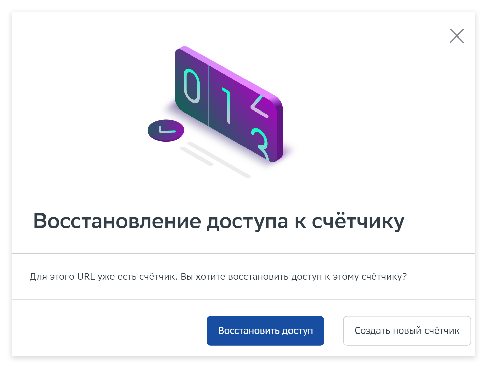

# Восстановление доступа к счётчику

**Шаг 1.** Для того, чтобы восстановить доступ к счётчику, нажмите кнопку «Добавить сайт».

<figure><figcaption></figcaption></figure>

**Шаг 2.** Введите адрес сайта, доступ к которому необходимо восстановить. Примите пользовательское соглашение. Завершите действие кнопкой «Создать счётчик».

<figure><figcaption></figcaption></figure>

**Шаг 3.** Нажмите на кнопку «Восстановить доступ». Если вы хотите создать новый счётчик, кликните на соответствующую плашку.&#x20;

<figure><figcaption></figcaption></figure>

**Шаг 4**. Выберите счётчик, к которому хотите восстановить доступ.

<figure><figcaption></figcaption></figure>

**Шаг 5.** После всех действий к вам на почту придет файл, который вы должны разместить на своем сайте в течение семи дней. После чего наш робот проведет проверку и выдаст доступ.


Если у вас остались вопросы по восстановлению счётчика, задайте службе поддержки ([counter@ads.sber.ru](mailto:counter@ads.sber.ru)). Обязательно укажите ID счетчика и URL вашего сайта. Поддержка Статистики от SberAds рассмотрит заявку в ближайшее время.

