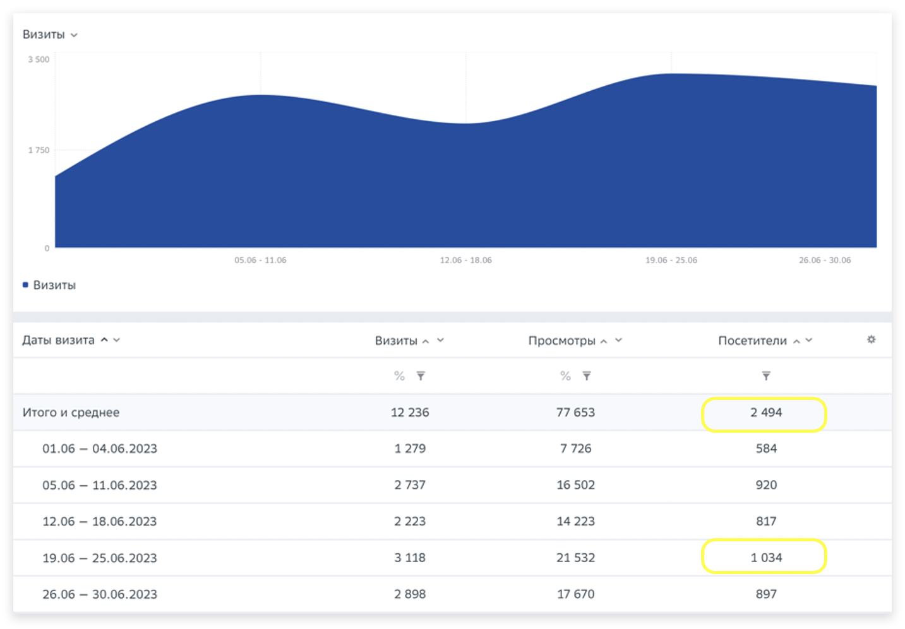

# Как правильно посчитать авторизованных пользователей?

### Как сделать, чтобы один и тот же посетитель засчитывался только один раз?

**Кейс**: Реальная численность сотрудников – 857 человек. Но если смотреть отчет «Посещаемость», критерий фильтрации – атрибут «принадлежность к компании», то посещаемость за неделю составляет 1034 человек. Эта цифра больше, чем вся численность сотрудников. Почему так и как это можно исправить?

<figure><figcaption></figcaption></figure>

**Ответ:** Мы ориентируемся на Cookie, поэтому, если один и тот же пользователь посещает сайт с разных устройств (например, с рабочего ноутбука, домашнего ноутбука и телефона), то каждый такой визит будет засчитываться как отдельный посетитель.&#x20;

Если вы хотите, чтобы один и тот же посетитель засчитывался в таком случае только один раз, необходимо передать параметры запроса [auth\_uid](../nastroika-sbora-i-otpravki-dannykh/veb-schyotchik/metody-po-rabote-s-schyotchikom-top-100/metod-dlya-peredachi-identifikatora-avtorizovannogo-polzovatelya.md) и воспользоваться метрикой «[Авторизованные пользователи](../rabota-s-otchyotami-v-analitike/metriki-analitiki/vychislyaemye-metriki.md)». Обратите внимание, после того, как вы настроите параметр запроса, будут корректироваться только новые данные. Старые отчеты с уже существующими данными останутся без изменений.
