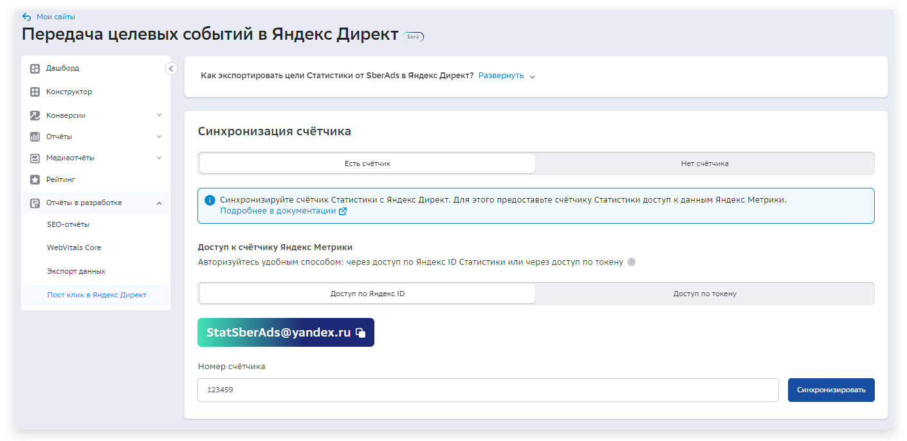
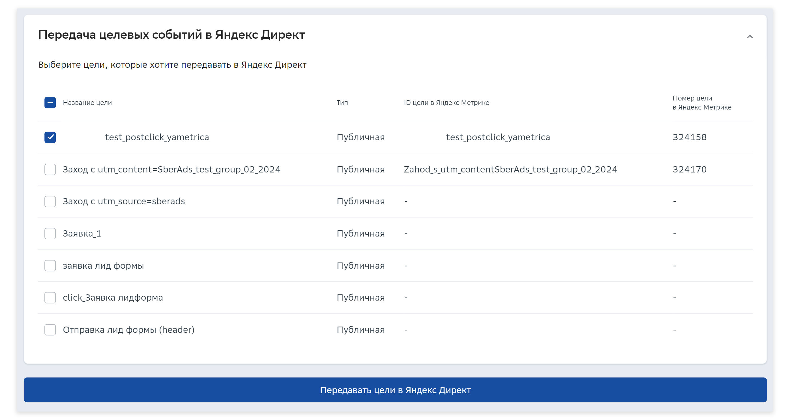
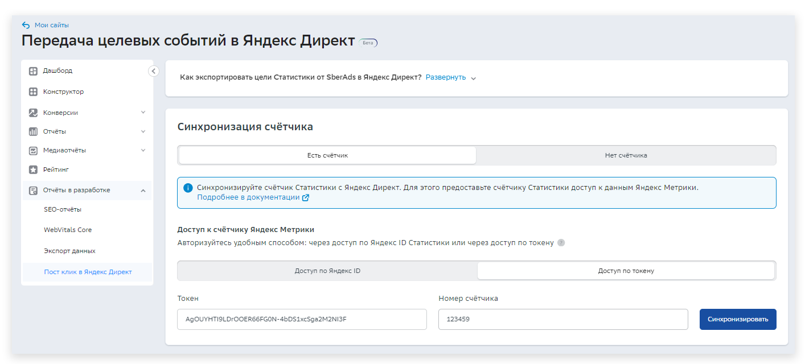

# Передача целевых событий в Яндекс Директ

Экспортируйте цели из вашего личного кабинета Статистики от SberAds в Яндекс Директ для повышения эффективности рекламных кампаний. Для передачи целей можете создать новый счетчик-мост Яндекс Метрики или воспользоваться уже существующим. Необходимо будет выбрать цели для передачи их в Яндекс Директа и пользователей, которые будут иметь к ним доступ.


Обратите внимание, что каждый пользователь, с которым вы поделились доступом, будет видеть события только по своей рекламной кампании (без доступа ко всей статистике сайта).


## Счётчика нет

Создайте новый счетчик-мост Яндекс Метрики, чтобы передавать цели в Яндекс Директ.

**Шаг 1.** В левой панели выберите раздел «Пост клик в Яндекс Директ». Нажмите кнопку «Создать счётчик».

<figure><figcaption></figcaption></figure>

Cчётчик создан и привязан.

<figure><figcaption></figcaption></figure>

**Шаг 2.** После создания счётчика вам будет доступен список целей, которые можно передать в Яндекс Директ.&#x20;

<figure><figcaption></figcaption></figure>

Выберите цели, которые хотите передавать в Яндекс Директ и нажмите кнопку «Передавать цели».

**Шаг 3.** Зайдите в Яндекс Метрику и выберите нужный вам счётчик. В нашем случае это счётчик с номером 123459

<figure><figcaption></figcaption></figure>

Выбранные нами цели «подтянулись» в счётчик.

<figure><figcaption></figcaption></figure>

## Счётчик есть

Авторизуйтесь удобным способом: по Яндекс ID Статистики или через токен:

#### Доступ по Яндекс ID

**Шаг 1.** Зайдите в аккаунт Яндекс Метрики и нажмите шестеренку (настройки) напротив счётчика, в который хотите передать цели.

<figure><figcaption></figcaption></figure>

**Шаг 2.** Откройте вкладку «Доступ», далее «Добавить пользователя». В поле логин введите Яндекс ID Статистики — [StatSberAds@yandex.ru](mailto:StatSberAds@yandex.ru). В правах доступа выберите «Редактировать» и нажмите кнопку «Добавить». Сохраните изменения.

<figure><figcaption></figcaption></figure>

**Шаг 3**. Перейдите в Статистику от SberAds. В поле «Номер счётчика» введите номер счётчика Яндекс Метрики, которому дали доступ к [StatSberAds@yandex.ru](mailto:StatSberAds@yandex.ru) в предыдущих шагах. Нажмите кнопку «Синхронизировать».

<figure><figcaption></figcaption></figure>

**Шаг 4.** Теперь вам доступен список целей, которые можно передать в Яндекс Директ. Поставьте галочки напротив нужных и нажмите кнопку «Передавать цели в Яндекс Директ». Выбранные вами цели «подтянутся» в счётчик Яндекс Метрики.

<figure><figcaption></figcaption></figure>

#### Доступ по токену

Вы можете передать цели, используя OAuth-токен. Токен будет использоваться для того, чтобы определить от имени какого пользователя Яндекс Директа приложение выполняет запрос. Подробнее об OAuth-токене читайте в документации Яндекс Метрики.

**Шаг 1.** Скопируйте токен из Яндекс.OAuth и вставьте его в поле «Токен» в интерфейсе Статистики. В поле «Номер счётчика» введите номер нужного вам счётчика Яндекс Метрики. Нажмите кнопку «Синхронизировать».

<figure><figcaption></figcaption></figure>

**Шаг 2.**  Теперь вам доступен список целей, которые можно передать в Яндекс Директ. Поставьте галочки напротив нужных и нажмите кнопку «Передавать цели в Яндекс Директ». Выбранные вами цели «подтянутся» в счётчик Яндекс Метрики.

<figure><figcaption></figcaption></figure>
